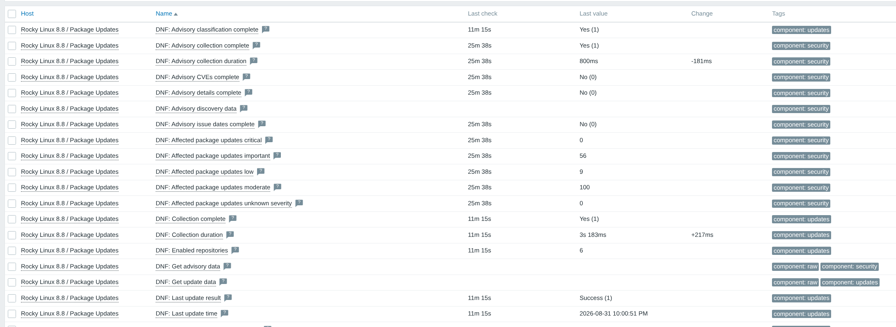
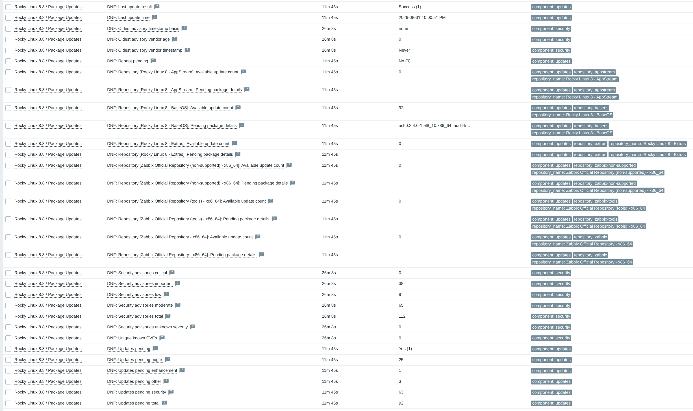
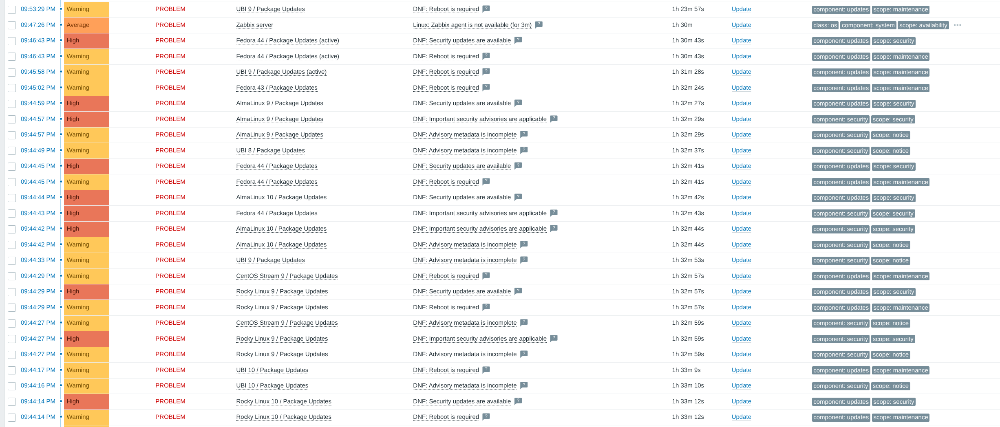
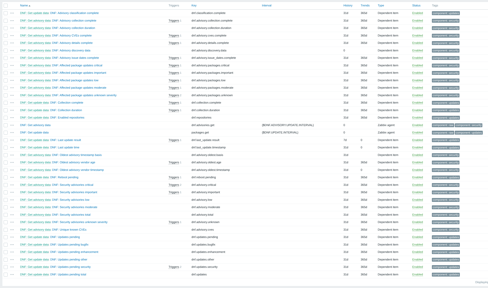
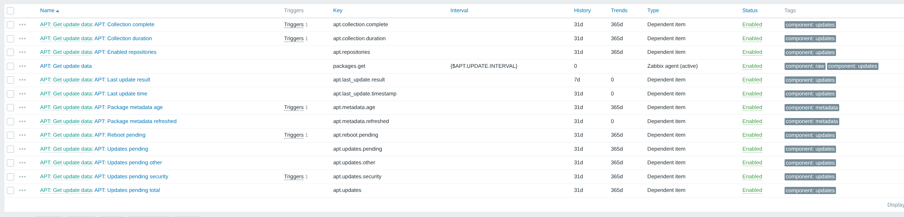
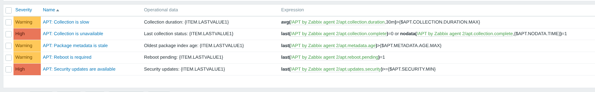
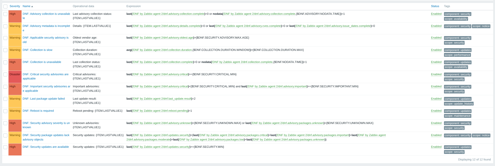
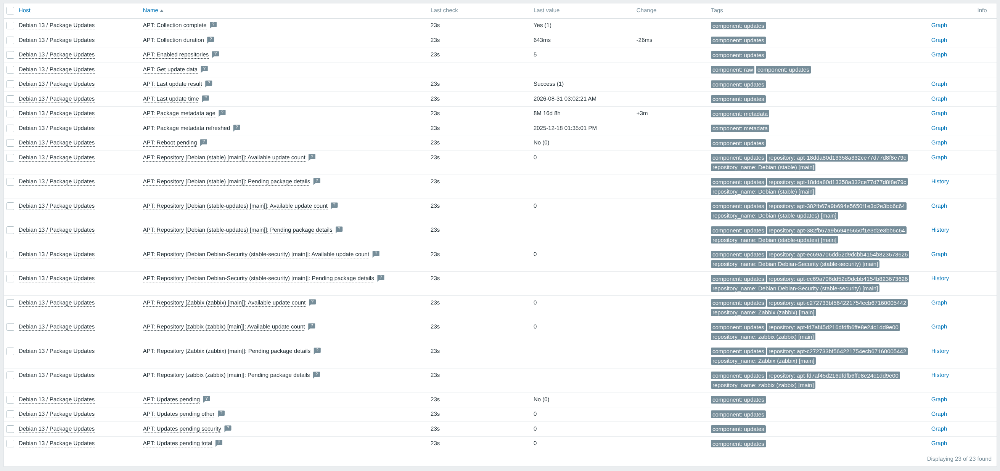

[](https://github.com/obviousaichicken/zabbix-agent2-plugin-package-updates/actions/workflows/checks.yaml)
[](https://github.com/obviousaichicken/zabbix-agent2-plugin-package-updates/actions/workflows/package-updates-integration.yaml)
[](https://github.com/obviousaichicken/zabbix-agent2-plugin-package-updates/actions/workflows/release.yaml)

# Package Updates for Zabbix Agent 2

A loadable `zabbix-agent2` plugin for monitoring package updates on DNF and APT systems.

It reports:

* Pending updates, grouped by repository and update type
* Security advisories and CVEs on DNF hosts
* Reboot status and the result of the last package transaction
* The age of local package metadata on APT hosts

It supports:

* RHEL/UBI 8, 9, and 10
* Fedora 43 and 44
* Rocky Linux 8, 9, and 10
* AlmaLinux 8, 9, and 10
* Oracle Linux 8, 9, and 10
* CentOS Stream 9 and 10
* Debian 12 and 13
* Ubuntu 22.04, 24.04, and 26.04

Additionally the plugin works with all `zabbix-agent2` versions in the 7.0, 7.2, and 7.4 branches.

<a href="docs/images/dnf-advisory-values-rocky8.png"></a>

<details>
<summary><strong>View more screenshots (7)</strong></summary>
<br>
<table>
  <tr>
    <td width="50%" valign="top"><a href="docs/images/dnf-package-values-rocky8.png"></a></td>
    <td width="50%" valign="top"><a href="docs/images/distribution-lab-problems.png"></a></td>
  </tr>
  <tr>
    <td width="50%" valign="top"><a href="docs/images/dnf-template-items.png"></a></td>
    <td width="50%" valign="top"><a href="docs/images/apt-template-items.png"></a></td>
  </tr>
  <tr>
    <td width="50%" valign="top"><a href="docs/images/apt-triggers.png"></a></td>
    <td width="50%" valign="top"><a href="docs/images/dnf-triggers.png"></a></td>
  </tr>
  <tr>
    <td width="50%" valign="top"><a href="docs/images/apt-package-values-debian13.png"></a></td>
    <td width="50%"></td>
  </tr>
</table>
</details>

## Quick start

### 1. Install the plugin

```bash
curl -fLO https://github.com/obviousaichicken/zabbix-agent2-plugin-package-updates/releases/latest/download/install.sh && sudo sh install.sh
```

The installer detects DNF or APT, verifies the downloaded binary, checks package-manager access as the `zabbix` user, validates the Agent 2 configuration, and restarts the service. On APT systems, package indexes must already exist; the installer does not run `apt-get update`.

### 2. Import the template

Download [template-package-updates-by-zabbix-agent2.yaml](template-package-updates-by-zabbix-agent2.yaml), import it from **Data collection > Templates > Import**, and link the matching passive or active DNF/APT template to the host.

### 3. Confirm collection

```bash
# Supported on DNF and APT hosts
sudo -u zabbix zabbix_agent2 -c /etc/zabbix/zabbix_agent2.conf -t packages.get

# DNF hosts also expose advisory collection
sudo -u zabbix zabbix_agent2 -c /etc/zabbix/zabbix_agent2.conf -t advisories.get
```

## Documentation

* [Templates and triggers](TEMPLATES.md) covers macros, items, triggers, repository discovery, per-advisory discovery, and advisory payload behavior.
* [Development](DEVELOPMENT.md) covers prerequisites, source builds, checks, the local Zabbix lab, project layout, and package-manager commands.

## Manual installation

```bash
# Download the latest binary and its SHA-256 checksum from GitHub Releases
curl -fL -o zabbix-agent2-plugin-package-updates https://github.com/obviousaichicken/zabbix-agent2-plugin-package-updates/releases/latest/download/zabbix-agent2-plugin-package-updates

# Download the checksum
curl -fL -o zabbix-agent2-plugin-package-updates.sha256 https://github.com/obviousaichicken/zabbix-agent2-plugin-package-updates/releases/latest/download/zabbix-agent2-plugin-package-updates.sha256

# Verify the binary
sha256sum --check zabbix-agent2-plugin-package-updates.sha256

# Install the binary
sudo install -D -m 0755 zabbix-agent2-plugin-package-updates /usr/sbin/zabbix-agent2-plugin/zabbix-agent2-plugin-package-updates

# Create the configuration file
sudo sh -c 'cat > /etc/zabbix/zabbix_agent2.d/plugins.d/package-updates.conf' <<'EOF'
Plugins.PackageUpdates.System.Path=/usr/sbin/zabbix-agent2-plugin/zabbix-agent2-plugin-package-updates
Plugins.PackageUpdates.System.Capacity=1
PluginTimeout=30
EOF

# Set configuration file permissions
sudo chmod 0644 /etc/zabbix/zabbix_agent2.d/plugins.d/package-updates.conf

# On systems with SELinux, apply the default installation-path contexts
sudo restorecon -Rv /usr/sbin/zabbix-agent2-plugin /etc/zabbix/zabbix_agent2.d/plugins.d/package-updates.conf

# Confirm that the zabbix user can query DNF on a DNF host
sudo -u zabbix dnf -q repolist
sudo -u zabbix dnf -q repoquery --upgrades

# Or confirm read-only APT access on a Debian/Ubuntu host. Populate indexes as
# root first if this host has never run apt-get update.
sudo -u zabbix apt-get indextargets
sudo -u zabbix dpkg-query --show
sudo -u zabbix apt-cache policy dpkg:$(dpkg --print-architecture)

# Restart the agent and check that it started correctly
sudo systemctl restart zabbix-agent2
systemctl status zabbix-agent2
```

Backend detection is automatic. Most installations do not need anything beyond the configuration shown above.

## Configuration

### Backend selection

The backend defaults to `auto`. The plugin reads `/etc/os-release`: Debian and Ubuntu families use APT, while Fedora and RHEL families use DNF. Startup fails if the distribution is unsupported or the required commands are missing. The installer also checks the distribution version against the support list above.

You can force a backend when testing a controlled image:

```ini
Plugins.PackageUpdates.Backend=dnf
# or
Plugins.PackageUpdates.Backend=apt
```

Valid values are `auto`, `dnf`, and `apt`. A forced backend skips distribution-family detection but still checks the required commands. Leave this setting out for normal installations.

### Reboot detection

DNF reboot status is determined from reboot-sensitive RPM install times and installed kernel packages compared with the running kernel. The plugin supports DNF4 and DNF5 without depending on an optional DNF reboot-detection plugin. APT reboot status follows `/run/reboot-required`.

### APT metadata

APT collection is read-only. It uses the installed-package database and local package indexes; it does not contact mirrors, download packages, take package-manager locks, or run `apt-get update`. A successful check means the local metadata was readable, not that a mirror is reachable.

The payload reports the oldest participating binary index as `metadata.refreshed_at` and its age as `metadata.age_seconds`. Missing or unreadable indexes fail the check. Old but readable indexes remain valid so the template can warn about stale metadata. Schedule `apt-get update` separately.

Only recognized official security pockets are counted as security updates; all other candidates are classified as `other`. Bugfix and enhancement classifications are unsupported. Update history is best effort and comes from retained `/var/log/apt/history.log*` files. Reboot detection uses `/run/reboot-required`.

## Troubleshooting

```bash
# Test package collection on either backend
sudo -u zabbix zabbix_agent2 -c /etc/zabbix/zabbix_agent2.conf -t packages.get

# Test the independently scheduled advisory item on a DNF host
sudo -u zabbix zabbix_agent2 -c /etc/zabbix/zabbix_agent2.conf -t advisories.get

# Run package collection directly
sudo /usr/sbin/zabbix-agent2-plugin/zabbix-agent2-plugin-package-updates --test

# Check for SELinux policy denials
sudo ausearch -m AVC -ts recent
```

## Upgrade

Run the installer again, test the item, then import the template from the same release. Install the binary before importing the template so every referenced key is available.

The package and advisory item keys are `packages.get` and `advisories.get`.

## Limitations

### DNF

* DNF4 uses list-only advisory collection to stay below Agent 2's timeout. It reports advisory IDs, severities, and affected packages, but detail, CVE, and issue-date completeness remain false. Per-advisory discovery is therefore unavailable on DNF4.
* DNF5 supports the 5.2 and 5.3-or-newer JSON formats. Malformed or unknown formats fail the check instead of falling back to text parsing.
* Results are based on enabled repository metadata. They do not say whether a vulnerability is exploitable or reachable.
* Check the completeness items before treating a zero CVE count or a missing date as final.
* Advisory checks run hourly by default and are limited to 8 MiB.
* Per-advisory discovery adds five items and one trigger for every selected advisory. IDs longer than 256 UTF-16 code units are not supported by discovery.

### APT

* The plugin does not refresh package indexes or check mirror health.
* Bugfix and enhancement classifications are unavailable.
* Package history is best effort because old APT logs may have been rotated away.
* APT does not provide the per-advisory monitoring available on DNF.

## AI Disclaimer

This project was developed with guidance from GPT-5.6 Sol and Claude Opus 5 for tedious refactoring, code review, and documentation.

## License

This project is licensed under the terms in [LICENSE](LICENSE).
